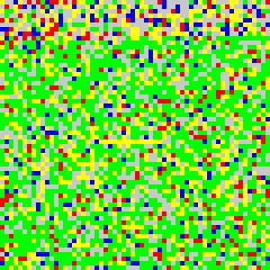
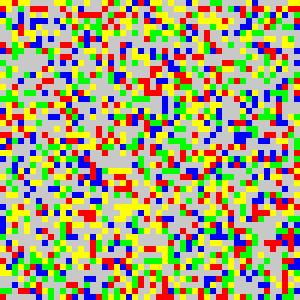
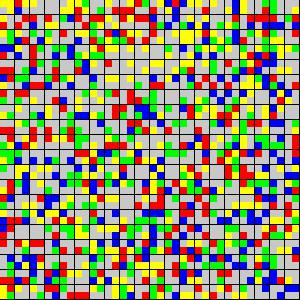
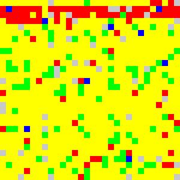
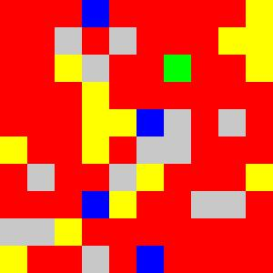

# # #TwitterMotion
# - Final project, COMS 3103 Fall 2016
# - by Justin Bleuel,  jmb2372
# 
# ### Project description
# 
# This project takes live tweets and converts it into an image that, through its color, represents the overall sentiment on whatever given search.
# 
# The colors of the image are determined by the polarity of the tweet (aka pleasantness) and its subjectivity (aka energy), these correspond to each of the four quandrants on the [Mood Meter](http://moodmeterapp.com/science/), a tool developed by psychologists to help promote emotional literacy.
# 
# <b>Yellow</b> corresponds to positive sentiment and subjective (aka high-energy) tweets.
#  <b>Green</b> corresponds to positive sentiment and objective tweets.
#  <b>Red</b> corresponds to negative and subjective tweets.
#  <b>Blue</b> corresponds to negative and objective tweets.
# 
# The subjectivity and polarity of the tweets are determined by TextBlob, a Python library for processing textual data and performing common NLP tasks (like sentiment analysis, see Dependencies, below).
# 
# It's been shown that different moods are better for different tasks: for example, most people are blue while they mourn. Friends consoling those mourning do best when they themselves are green (which is why it's so cool seeing the sentiment on #NationalStressAwarenessDay over 3600 tweets be so overwhelmingly green, [see Graphics section, below])
# 
# There is rarely a consensus of which emotion a topic will elicit related to tweets (see examples for Clinton and Trump tweets, below), but by applying this program on a macro level (looking at several hundred, even thousand tweets [though this might take 10m+ to run]), we can see whether people are regulating their emotions in a way that is most beneficial to the topic at hand.
# 
# ### Outline of structure of code
# 
# From the bottom up:
# - the StdOutOutListener class lets us stream live tweets given any streamlistener, which we filter by whatever 'term' the user inputs on the Flask page
# - The Flask page runs on localhost:2372 (my UNI numbers). It runs a simple HTML doc that provides two input fields: one for the Twitter search term, and another for the size of the image -- i.e. inputs of "Election" and "144" will return a 12x12 image of tweets related to the term "Election" (this number is rounded down to the nearest square value [e.g. 22-->16)
# - Once the tweets are streamed (this may take some time given the term's popularity as well as the number of tweets requested), the created image is shown using PIL's .show() method and will be stored in the directory that the .ipynb file exists in, under the "/img" folder, with the name "termSquareNum.jpg" (i.e "Election" "144" --> "img/Election144.jpg")
# - These terms then call their respective methods to set the image size and stream the given term
# - The tweets are stored in a list, which is then iterated through to determine each tweet's sentiment values (polarity and subjectivity) -- determined by TextBlob's API
# - Depending on these values, each tweet is assigned a color given Mood Meter's quadrants
# - These colors then fill an array which is then converted into the image
# - Each square-dot that makes up the overall image represents a given Tweet (those with (0, 0) values are assigned the color gray)
# 
# ### How to run
# - Make sure all proper dependencies are installed (see Dependencies section, below)
# - Run the code below in the .ipynb
# - Open new tab, direct to localhost:2372
# - Fill in first form with desired search term (I suggest something that likely has a high volume of tweets, like "election" "clinton" "trump" etc.)
# - Fill in the second form with the desired image size (i.e. the number of tweets you'd like to make up an image, this should be a square value [else it'll be rounded down to one])
# - Once submitted wait, created image will then be displayed and saved to director "/img/img_name.jpg" (img naming described above in previous section)
# - The forms are reset and the user can continue creating images on new terms / of different sizes
# - Note Twitter streaming limits (status printed when reaching limit) and note for large streams can take several minutes, I suggest testing on smaller squarenumbers like 49, 64, 81, etc. but really cool seeing the images from larger streams (like 900, 1600, 2500, etc.)
# 
# - if you encounter a problem, interuppt the kernal in ipynb, run the code again, and refresh the localhost:2372 page
# 
# ### Dependencies
# - [Tweepy](http://www.tweepy.org/) , Twitter's API to stream live tweets
# - [TextBlob](http://textblob.readthedocs.io/en/dev/) , Python library for processing textual data / simple API for common NLP tasks (used for sentiment analysis of each tweet)
# - [PIL](http://www.pythonware.com/products/pil/), Python Imaging Library (used to create mood image)
# - [NumPy](http://www.numpy.org/), API for scientific computing (used to manage sentiment array to then create image from it)
# - [Flask](http://flask.pocoo.org/), web framework to run UI / allow for user input
# - [Math](https://docs.python.org/3/library/math.html), perform mathematical functions (i.e. sqrt() for block sizes)
# 
# Can install each with: pip install 'dependency_name'
# 
# 
# ### Problems Encountered
# - TextBlob not being able to get clear sentiment / polarity on every sentence, every tweet that is returned with a value of (0.0, 0.0) is colored gray (which is unfortunate because provides a less clear image of sentiment)
#     - TextBlobs helps provide faster solutions to NLP toolkit, but wish could have more flexibility // at least provide some guess rather than 0
#     
# - Tweepy API when run on a specific search only returns 15 results, which was too few to create a clear picture on the sentiment. To solve this I decided to use their Streaming API, but this causes a noticeable time-delay when searching for non-trending tweets at a large volume (since pull live Tweets as they come in).
#     - would have preferred to have a more robust search API
# 
# ### Graphics
# Example images created (stored in /img folder when run) 
# - Stress (60x60 tweets): 
#     - NOTE: 11/2 was #NationalStressAwarenessDay on Twitter -- great to see such positivity and objectiveness re: stress on this day! [From a psych point of view, this is the best quadrant of the mood meter to be in for combatting stress :)]
#     - Also note: taking a stream of 3600 tweets took approx. 15m to run. Still works fine (and image result looks nicer) but easier to test with smaller square numbers like 25, 49, 64, etc.
# - Clinton (50x50 tweets): 
# - Trump (40x40 tweets): 
# - Excited (30x30 tweets): 
# - Mad (10x10 tweets): 
# 
# 
# ### Evaluation of Python
# I believe Python was a great program to build something like this with. I have a much greater fluency now with Python and found it fairly seamless to string together data from several different API's and libraries.
# 
# Online, there seemed to be almost an endless supply of well documented Python APIs that made scoping a project and thinking of what exactly to do the most difficult part. I also found there to be many resources regarding using the APIs on Python specifically that were very helpful. I was previously most proficient in Java, but honestly would not know where to necessarily begin on a project like this in Java.
# 
# Really glad I took the course, #teamPython
# 
# ### Files in zip
# jmb2372_project.ipynb -- this file
#  /templates -- directory with index.html file (used for Flask page)
#  /img -- director with several example #TweetMotion .jpg files as well as location where images stored when program run
